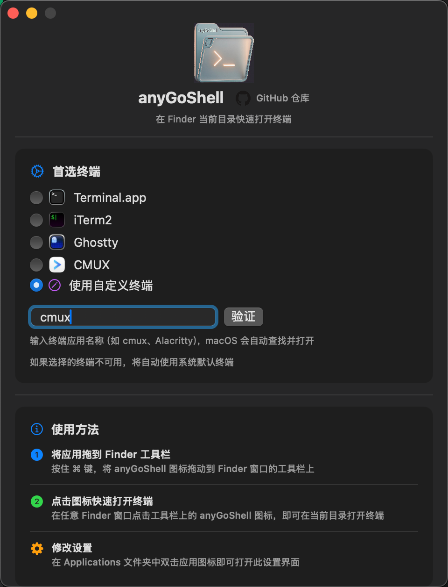

# anyGoShell

[中文文档](README.md)｜[English](README_English.md)

**极简 macOS 工具，从 Finder 工具栏一键打开终端。**

[](https://www.apple.com/macos/)
[](https://swift.org)
[](LICENSE)
[](https://github.com/tom-hanks/anyGoShell)



---

## 简介

anyGoShell 是 Finder 与终端之间的无缝桥梁。只需点击 Finder 工具栏图标，即可在当前目录立即打开终端会话 —— 无需手动导航。

专为开发者、高级用户以及频繁在文件浏览与命令行操作之间切换的人群设计。

## 功能特性

| 特性 | 说明 |
|------|------|
| **工具栏集成** | 通过拖放添加到 Finder 工具栏（⌘ + 拖动） |
| **智能检测** | 自动检测已安装的终端，隐藏不可用的选项 |
| **原生图标** | 显示终端应用的实际图标，视觉识别更直观 |
| **自定义终端** | 支持通过名称输入任意终端应用 |
| **回退机制** | 首选终端不可用时自动使用 Terminal.app |
| **轻量高效** | 纯 Swift 实现，资源占用极低 |

### 支持的终端

- **Terminal.app** — macOS 内置终端
- **iTerm2** — 广受欢迎的第三方终端
- **Warp** — 现代 AI 驱动终端
- **Ghostty** — 高性能终端模拟器
- **WezTerm** — 跨平台终端复用器
- **任意自定义终端** — 直接输入应用名称

---

## 安装

### Homebrew（推荐）

```bash
brew install tom-hanks/tap/anyGoShell
```

### 手动构建

```bash
# 克隆仓库
git clone https://github.com/tom-hanks/anyGoShell.git
cd anyGoShell

# 构建并安装
make install
```

---

## 快速开始

### 步骤一：添加到 Finder 工具栏

1. 打开 `/Applications` 文件夹
2. 按住 **⌘ (Command)** 键
3. 将 `anyGoShell.app` 拖动到任意 Finder 窗口的工具栏

### 步骤二：点击启动

点击工具栏图标 —— 终端即刻在当前目录打开。

---

## 配置

### 图形界面设置

双击 `/Applications` 中的应用图标打开设置面板。

### 命令行配置

```bash
# Terminal.app（默认）
defaults write com.solarhell.anyGoShell PreferredTerminal Terminal

# iTerm2
defaults write com.solarhell.anyGoShell PreferredTerminal iTerm

# Warp / Ghostty / WezTerm
defaults write com.solarhell.anyGoShell PreferredTerminal Warp
defaults write com.solarhell.anyGoShell PreferredTerminal Ghostty
defaults write com.solarhell.anyGoShell PreferredTerminal WezTerm

# 自定义终端
defaults write com.solarhell.anyGoShell UseCustomTerminal -bool true
defaults write com.solarhell.anyGoShell CustomTerminalName "Alacritty"
```

---

## 开发

### 构建命令

```bash
make help       # 列出所有命令
make build      # 编译并创建 App Bundle
make install    # 安装到 /Applications
make clean      # 清除构建产物
make run        # 启动应用
make release    # 创建可分发 ZIP 包
```

### 项目结构

```
anyGoShell/
├── Package.swift           # SPM 配置文件
├── Makefile                # 构建自动化
├── Sources/
│   ├── main.swift          # 入口文件
│   ├── Views.swift         # SwiftUI 界面
│   ├── TerminalManager.swift
│   ├── Terminal.swift      # ScriptingBridge 定义
│   ├── Finder.swift        # ScriptingBridge 定义
│   ├── FinderManager.swift
│   └── L10n.swift          # 本地化
├── Resources/
│   ├── Info.plist
│   ├── anyGoShell.entitlements
│   ├── AppIcon.icns
│   ├── en.lproj/
│   └── zh-Hans.lproj/
└── screenshots/
```

---

## 系统要求

- **macOS Sequoia 15.0+**
- **Xcode 16+**（用于构建）

---

## 技术实现

anyGoShell 使用 Apple Events (AppleScript) 实现：

1. 查询最前端 Finder 窗口的当前路径
2. 若无 Finder 窗口则回退至桌面路径
3. 通过 AppleScript API 调用首选终端
4. 终端启动后自动退出应用

---

## 参与贡献

欢迎提交 Issue 或 Pull Request：[GitHub](https://github.com/tom-hanks/anyGoShell)

---

## 许可证

本项目采用 [MIT License](LICENSE) 开源协议。

---

## 相关链接

- **代码仓库**: [github.com/tom-hanks/anyGoShell](https://github.com/tom-hanks/anyGoShell)
- **问题反馈**: [提交 Issue](https://github.com/tom-hanks/anyGoShell/issues)